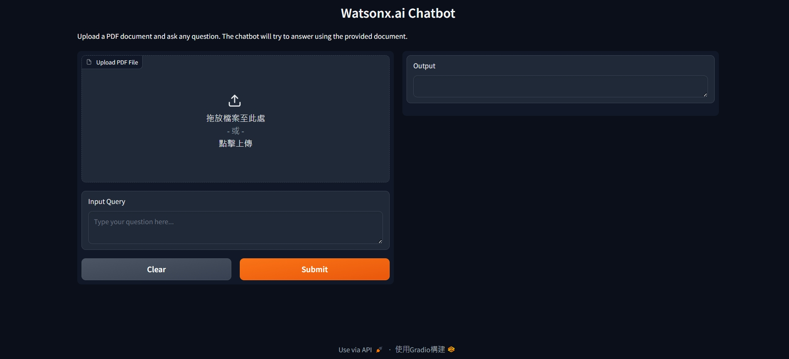

# Langchain-Chatbot-with-document-loading
By implement RAG and Langchain, here I create a Chatbot with document loading to proceed some basic mession, such as summery generation or others.

## Features in this project

- PDF / CSV / json / Markdown / TxT document ingestion
- Parent–Child chunking strategy
- Watsonx Embeddings + LLM leveraging
- Chroma Vector Store
- Gradio Web UI

Note: This project requires access to IBM watsonx.ai.
 If you do not have credentials, 
 please refer to the code structure and architecture sections for implementation details.


## Contents of code

qabot\
├── doc_load_embbed.py      # documents loading func. + embbeding func.\
&emsp;&emsp;└── document_loader     # PDF / CSV / TXT / json loader

├── qabot.py                # Gradio entry point \
&emsp;&emsp;├── llm \
&emsp;&emsp;&emsp;&emsp;├── watsonx_llm()    # get_llm() \
&emsp;&emsp;&emsp;&emsp;├── model_id      			# model_id \
&emsp;&emsp;&emsp;&emsp;└── project_id       # project_id \

&emsp;&emsp;├── retrievers\
&emsp;&emsp;&emsp;&emsp;├── parent_retriever  # ParentDocumentRetriever \
&emsp;&emsp;&emsp;&emsp;├── embedding									# watsonx_embedding() \
&emsp;&emsp;&emsp;&emsp;├── vectorstore 						# Chroma()\
&emsp;&emsp;&emsp;&emsp;└── document_loader\

&emsp;&emsp;├── qa_chains\
&emsp;&emsp;&emsp;&emsp;├── llm\
&emsp;&emsp;&emsp;&emsp;├── retriever\
&emsp;&emsp;&emsp;&emsp;└── RetrievalQA          # RetrievalQA (chain_type="stuff")\

&emsp;&emsp;├── gradio\
&emsp;&emsp;&emsp;&emsp;└── gr.Interface\

├── Setting up a virtual environment + requirements.txt   # Necessary libs\

└── README.md

## How to operate

- First, you might need to create a virtual environment to operate it.

### Setting up a virtual environment

```bash
python3.11 -m venv my_env
source my_env/bin/activate

```
You should see "(my_env)" before your machine as the env had set up successfully.

- Second, you'll need to install necessary packages.
```bash
pip install -r requirements.txt
```

- Third, after libs installed, you can now compile and excute the code.

```bash
python3.11 qabot.py
```

- Finally, through the following http site at your local terminal, you now can access the Langchain-Chatbot-with-document-loading, and ask it any question that you see fit.

```bash
http://---.-.-.-:7860
```
The expected format is shown in the figure below. 

